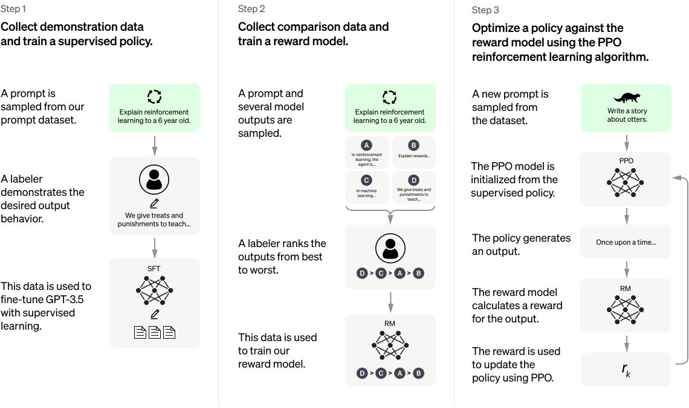

<div align="center">
  
<div>&nbsp;</div>
</div>

<div align="center">

[中文](README_zh.md) | English
</div>

## Table of Contents
- [Table of Contents](#table-of-contents)
- [Introduction](#introduction)
- [Illustrating  RLHF](#illustrating--rlhf)
  - [Step 1: Train Supervised Fine-Tuning (SFT)](#step-1-train-supervised-fine-tuning-sft)
  - [Step 2: Train Reward Model (RM)](#step-2-train-reward-model-rm)
  - [Step 3: Optimize the Policy Using Reinforcement Learning(RLHF)](#step-3-optimize-the-policy-using-reinforcement-learningrlhf)
- [RLHF Dataset preparation](#rlhf-dataset-preparation)
- [Examples](#examples)
  - [Example1: Learning to summarize with human feedback](#example1-learning-to-summarize-with-human-feedback)
    - [Step1: Supervised Fine-Tuning (SFT)](#step1-supervised-fine-tuning-sft)
    - [Step2: Training the Reward Model](#step2-training-the-reward-model)
    - [Step3: Fine-Tuning the Model using PPO](#step3-fine-tuning-the-model-using-ppo)
  - [Example2: Learning to generate positive sentiment with human feedback](#example2-learning-to-generate-positive-sentiment-with-human-feedback)
  - [Example3: StackLLaMA: Train LLaMA with RLHF on StackExchange](#example3-stackllama-train-llama-with-rlhf-on-stackexchange)
- [Installation](#installation)
- [Support Model](#support-model)
- [Contributing](#contributing)
- [License](#license)


## Introduction

`Open-ChatGPT`  is a open-source library that allows you to train a  hyper-personalized ChatGPT-like ai model using your own data and the least amount of compute possible.

I have Impleamented RLHF (Reinforcement Learning with Human Feedback) powered by huggingface's transformer library. It supports distributed training and offloading, which can fit extremly large models.

If you like the project, please show your support by [leaving a star ⭐](https://github.com/jianzhnie/open-chatgpt/stargazers).


## Illustrating  RLHF
<details><summary>CLICK ME</summary>
<p>

ChatGPT continues the technical path of [InstructGPT/GPT3.5](https://arxiv.org/abs/2203.02155) and adds RLHF (Reinforcement Learning from Human Feedback) which enhances the adjustment of the model output by humans and sorts the results with greater understanding.

Reinforcement learning from human feedback (RLHF) is a challenging concept as it involves multiple model training processes and different deployment stages. We break down the training process into three core steps:

<div align="center">
</img>

*<a href="https://openai.com/blog/chatgpt/">official chatgpt blogpost</a>*
</div>

### Step 1: Train Supervised Fine-Tuning (SFT)

GPT 3.5 itself has difficulty in understanding the different intentions implied in various types of human instructions, and it is also difficult to judge whether the generated content is of high quality. To make [GPT 3.5](https://arxiv.org/abs/2203.02155) initially understand the intent of instructions, high-quality answers are given by human annotators for randomly selected questions in the dataset, and the GPT-3.5 model is fine-tuned with these manually labeled data to obtain the SFT model (Supervised Fine-Tuning).

The SFT model at this point is already better than GPT-3 in following instructions/dialogues, but may not necessarily align with human preferences.


<div align="center">
  
</div>

### Step 2: Train Reward Model (RM)

The main objective of this stage is to train a reward model by manually labeled training data (about 33K data). Questions are randomly selected from the dataset, and multiple different answers are generated for each question using the model generated in the first stage. Human annotators consider these results comprehensively and provide a ranking order. This process is similar to a coach or teacher's guidance.

Next, use this ranking result data to train the reward model. For multiple ranking results, pairwise combinations form multiple training data pairs. The RM model accepts an input and provides a score that evaluates the quality of the answer. Thus, for a pair of training data, the parameters are adjusted so that the score for a high-quality answer is higher than that for a low-quality answer.

<div align="center">
  
</div>

### Step 3: Optimize the Policy Using Reinforcement Learning(RLHF)

Finally, once we have the trained SFT model and reward model (RM), we can use reinforcement learning (RL) to fine-tune the SFT model based on feedback using RM. This step keeps our SFT model aligned with human preferences.

This stage uses the reward model trained in the second stage and updates the pre-trained model parameters based on the reward score. Questions are randomly selected from the dataset, and the PPO model is used to generate answers, and the RM model trained in the previous stage is used to provide quality scores. The reward scores are passed in sequence, resulting in a policy gradient, and the PPO model parameters are updated through reinforcement learning.

<div align="center">
  
</div>


If you want to learn more details about RLHF technology, I strongly recommend reading Huggingface's blog [Illustrating Reinforcement Learning from Human Feedback (RLHF)](https://huggingface.co/blog/rlhf) and the [中文翻译版](https://jianzhnie.github.io/machine-learning-wiki/#/deep-rl/papers/RLHF).


</p>
</details>

## RLHF Dataset preparation

<details><summary>CLICK ME</summary>
<p>

To successfully train a ChatGPT-like assistant, you need 3 different datasets: `actor_training_data`, `rlhf_training_data` and `reward_training_data`.

Alternatively, training can be bootstrapped using a pre-existing dataset available on HuggingFace.  High quality candidates are namely the `Anthropic HH RLHF` and the `Stanford Human Preference datasets`, `Reddit TL;DR dataset` and  `Comparisons datasets`.

|                                           Dataset                                            |                                                                            Description                                                                            |     |
| :------------------------------------------------------------------------------------------: | :---------------------------------------------------------------------------------------------------------------------------------------------------------------: | --- |
|            [Anthropic HH RLHF](https://huggingface.co/datasets/Anthropic/hh-rlhf)            |                    This dataset consists of structured question/response pairs with a LLM chatbot that include chosen and rejected responses.                     |     |
| [Stanford Human Preferences Dataset (SHP)](https://huggingface.co/datasets/stanfordnlp/SHP)  | This dataset is curated from selected "ask" subreddits and contains questions spanning a wide array of question/answer pairs based on the most upvoted responses. |     |
|    [Reddit TL;DR dataset](https://huggingface.co/datasets/CarperAI/openai_summarize_tldr)    |         The TL;DR Summary Dataset is a collection of carefully selected Reddit posts that contain both the main content and a summary created by a human.         |     |
| [Comparisons dataset](https://huggingface.co/datasets/CarperAI/openai_summarize_comparisons) |    It includes Reddit posts and two summaries for each post, as well as a selection value indicating which of the two summaries the human annotator preferred.    |     |

</p>
</details>

## Examples

### Example1: Learning to summarize with human feedback

<details><summary>CLICK ME</summary>
<p>

#### Step1: Supervised Fine-Tuning (SFT)

Firstly, we will fine-tune the transformer model for text summarization on the [`TL;DR`](https://huggingface.co/datasets/CarperAI/openai_summarize_tldr) dataset.

This is relatively straightforward. Load the dataset, tokenize it, and then train the model. The entire pipeline is built using HuggingFace.

```shell
cd scripts/
python  train_fintune_summarize.py
```

The model is evaluated using the ROUGE score. The best model is selected based on the average ROUGE score on the validation set. This model will be used to initialize the reward model, which will be further fine-tuned using PPO.

#### Step2: Training the Reward Model

Our reward model is trained on a collected human quality judgement dataset [Comparisons dataset](https://huggingface.co/datasets/CarperAI/openai_summarize_comparisons), You can download the dataset from huggingface automatically.

We will initialize the reward model from the SFT model and attach a randomly initialized linear head to output a scalar value on top.

Next, we will delve into how the data is input to the model, the loss function, and other issues with the reward model.

Use these code to train your reward model.

```shell
cd scripts/
python train_reward_model.py
```

#### Step3: Fine-Tuning the Model using PPO

We use [awesome-chatgpt-prompts](https://huggingface.co/datasets/fka/awesome-chatgpt-prompts) as example dataset. It is a small dataset with hundreds of prompts.

```python
python train_ppo_rlhf.py
```

</p>
</details>


### Example2: Learning to generate positive sentiment with human feedback

```shell
python gpt2-sentiment.py
```


### Example3: StackLLaMA: Train LLaMA with RLHF on StackExchange


```shell
```


## Installation

```bash
git clone https://github.com/jianzhnie/open-chatgpt.git
pip install -r requirements.txt
```

## Support Model

<details><summary><b><i> LLM </i></b></summary>

We support models that can be run efficiently with a limited amount of compute. These are the models with less than 20B parameters currently supported :

- GPTJ: 6B
- GPTNeoX: 1.3B, 20B
- OPT: 125M, 359M, 1.3B, 2.7B, 6.7B, 13B
- BLOOM: 560M, 1.1B, 1.7B, 3B, 7.1B
- BLOOMZ: 560M, 1.1B, 1.7B, 3B, 7.1B

</details>


## Contributing

Our purpose is to make this repo even better. If you are interested in contributing, please refer to HERE for instructions in contribution.

## License

`Openn-ChatGPT` is released under the Apache 2.0 license.
